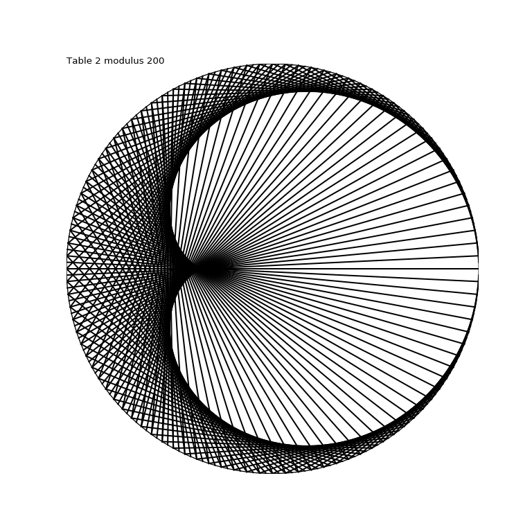
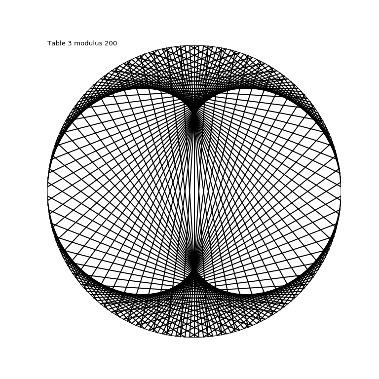
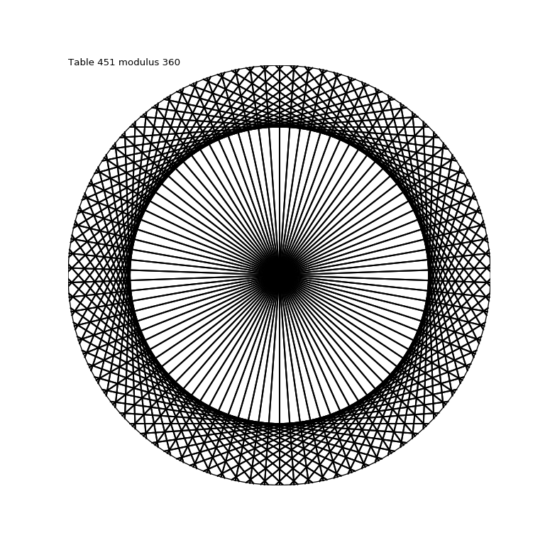
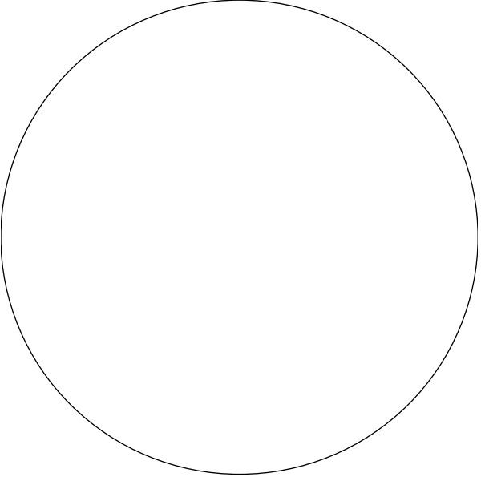
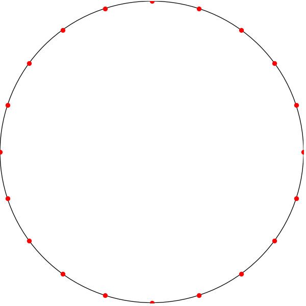
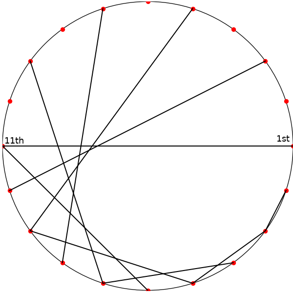
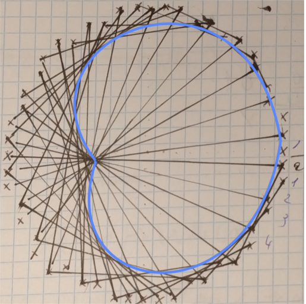

# ModulusTable
Draw extremly complicated shapes with only 2 basic rules, based on the multiplications tables.

# Required dependencies
* Python 3.x
* Python 3 MathplotLib

```
Debian / Ubuntu / Fedora / Red Hat: python3-matplotlib
Arch: python-matplotlib
```
  or 
```
pip3 install matplotlib
```
> For more see https://matplotlib.org/users/installing.html
 
# Tested
 - Debian sid up-to-date
 - Linux 4.14.0-1-amd64
 - Python3 3.6.4rc1
 - matplotlib 2.1.0

# Some results




# Mathematics constructions rules

1. Draw a circle



2. Choose a modulo (integer), let's call it 'p'. I chose 20, 'p=20'.

3. Add 'p' dots  on your circle. The distance between 1st and the 2nd dot have to be the same as the distance between the 2nd and 3rd dot, as for the 15th and the 16th... 



4. Choose a number 'n', it must be positive, can be a decimal. This number is the multiplication table you want to represent. I chose 2, 'n=2'.

5. This will be the last part, now join the dots. Join the 1st dot to the 1*n=2nd dot. Join the 2nd dot to the 2*n=4th dot. And so on... The 11th dot will be linked wit the 1st one because it's one of the modulo's properties.



6. Now it's time to repeat it with a bigger modulus or another table. (*^▽^*)



# Example of results, with tables incrementing by 0.02, with 25 tables showing every seconds

[](https://www.youtube.com/watch?v=-rv1z8zVWBw)
